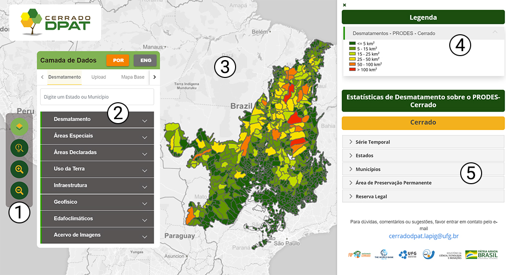
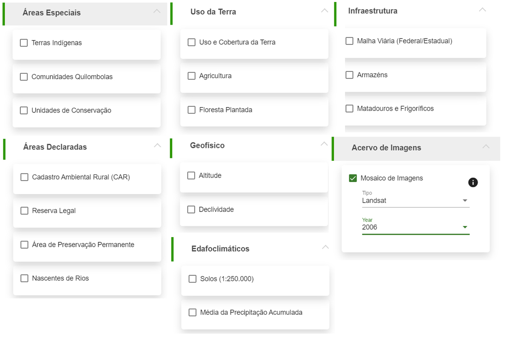
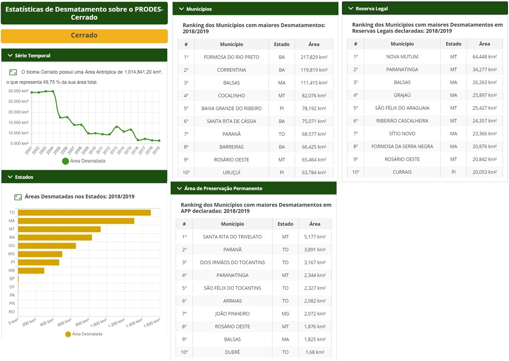
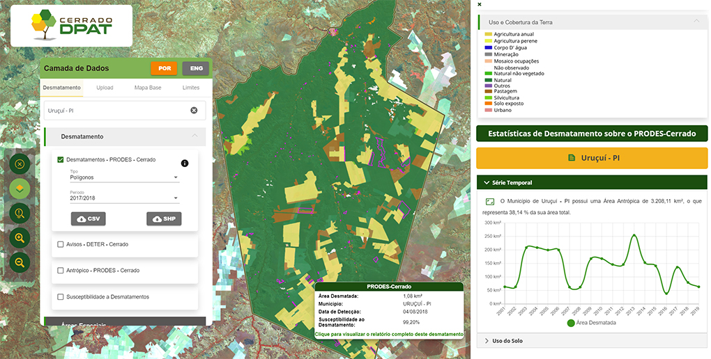
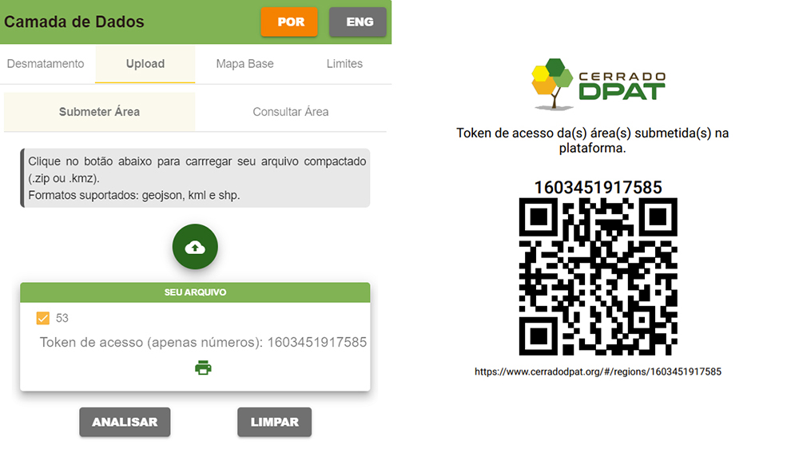

# Funcionalidades

## Dashboard 

O dashboard do Cerrado DPAT é formado por cinco elementos principais:

<i>Dashboard do Cerrado DPAT.</i>

**1 - Controle de Visualização**

Permite o controle do nível de zoom do mapa, além de ocultar e ativar a visualização da “Camada de Dados”. Também fornece ao usuário o acesso aos materiais explicativos da plataforma, tais como vídeos de eventos e tutoriais.

**2 - Camada de Dados**

Agrega todos os dados que podem ser exibidos no mapa, agrupados nas seguintes seções: Desmatamento; Áreas Especiais; Áreas Declaradas; Uso da Terra; Infraestrutura; Geofísico; Edafoclimáticos; Acervo de Imagens. Também permite ao usuário, com opções agrupadas em abas, o controle do mapa base (Mapbox, Google Maps e Bing), dos limites que são mostrados no mapa, e o upload de uma área de interesse que pode ser enviada nos formatos shapefile, geojson e kml.

<i>Camadas de dados que podem ser ativadas e visualizadas no mapa.</i>

**3 - Mapa interativo**

Área onde todas as camadas de dados são visualizadas.

**4 - Legenda**

Legenda correspondente às camadas de dados habilitadas para visualização.

**5 - Estatísticas de Desmatamento sobre o PRODES-Cerrado**

Expõe as estatísticas de desmatamento e uso do solo de acordo com a unidade de análise escolhida pelo usuário (Estado ou Município). Por padrão, exibe para todo o bioma Cerrado, o total anual da área desmatada no período 2000-2019. De acordo com o ano de interesse do usuário e, a partir do cruzamento com dados do Cadastro Ambiental Rural (CAR), também apresenta o total desmatado em Área de Preservação Permanente (APP) e em Reserva Legal (RL) nos dez municípios com a maior área desmatada dentro destas categorias.

<i>Estatísticas gerais para municípios, estados e todo o bioma Cerrado.</i>

## Camada de dados - desmatamento

Essa seção tem por objetivo espacializar o total desmatado, detectado em cada ano, pelos sistemas PRODES-Cerrado e DETER-Cerrado. Estes dados podem ser ativados para dois níveis: município e polígono.

Destaca-se também a possibilidade de ativar os polígonos interseccionados com propriedades participantes do projeto FIP ABC, assim como todas as áreas desmatadas visitadas em campo, com os respectivos dados coletados em cada área. Uma outra forma de visualização do dado PRODES-Cerrado é por total acumulado anual. Ou seja, a área antrópica total do bioma Cerrado para cada ano.

Para verificar a suscetibilidade ao desmatamento dos polígonos detectados a partir de 2016, foram criadas duas superfícies. Estas camadas, com resolução de 100m, foram concebidas a partir dos padrões observados nos desmatamentos pequenos (< 0,5 km²) e grandes (> 0,5 km²) ocorridos entre os anos de 2010 e 2015.

 
 
 
 

## Visualização em nivel municipal

O Cerrado DPAT permite a visualização de estatísticas e camadas para cada um dos estados e 1.386 municípios do bioma Cerrado. Estes municípios podem ser selecionados por meio de uma busca rápida localizada na “Camada de Dados”. Assim, um zoom é aplicado para a área de interesse, junto com estatísticas referentes à série histórica dos dados PRODES-Cerrado, uso e cobertura do solo no ano de 2013 (dados Terraclass Cerrado), e área agrícola mapeada durante a safra 2013/14 (dados Agrosatélite). Além dos dados previamente carregados, destaca-se também a possibilidade da ativação de todas as camadas de dados (e.g., declividade, solos, susceptibilidade ao desmatamento, precipitação, unidades de conservação, terras indígenas, terras quilombolas, dados do CAR, florestas plantadas, silos e armazéns, rodovias e frigoríficos pertencentes ao sistema de inspeção federal).

<i>Visualização em nível municipal.</i>

## Upload de dados geográficos  

Considerando as necessidades específicas de cada usuário da ferramenta Cerrado DPAT, a aba “Upload” (localizada na “Camada de Dados”) permite a submissão de arquivos shapefile e geojson (compactados em .zip) ou .kml e .kmz (produzidos pelo Google Earth). Após a submissão do arquivo espacial, os limites da área de interesse já podem ser visualizados no mapa. Um token, numérico e em QR Code, também é criado para eventuais compartilhamentos.

