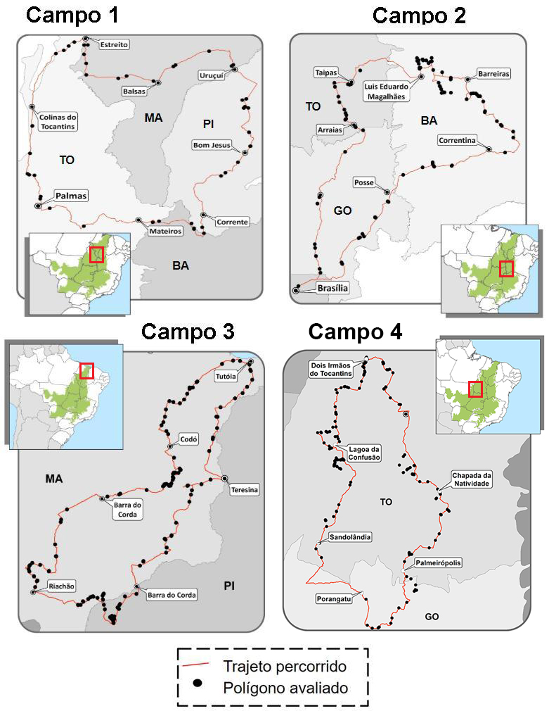
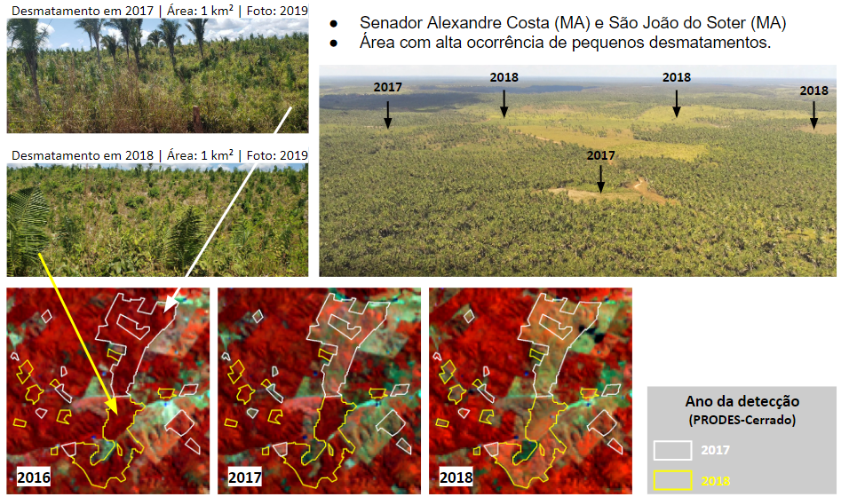
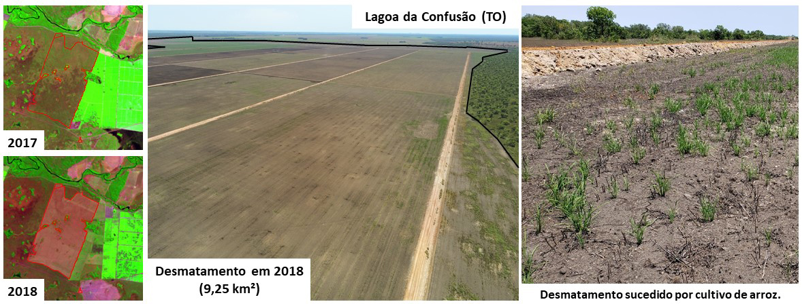
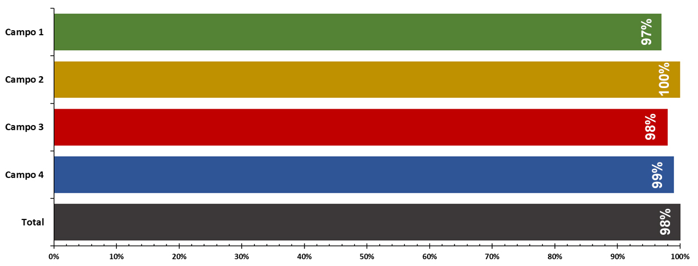
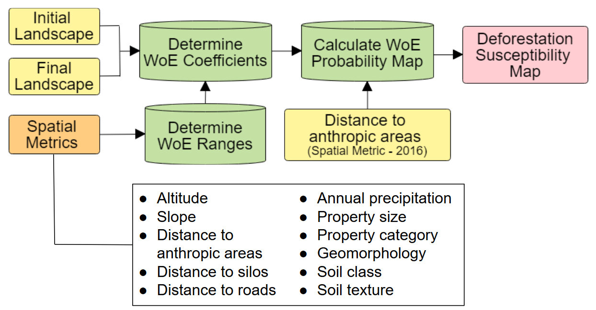
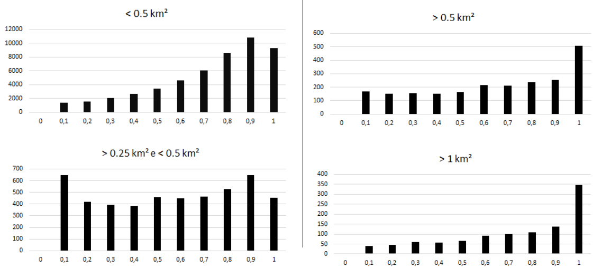
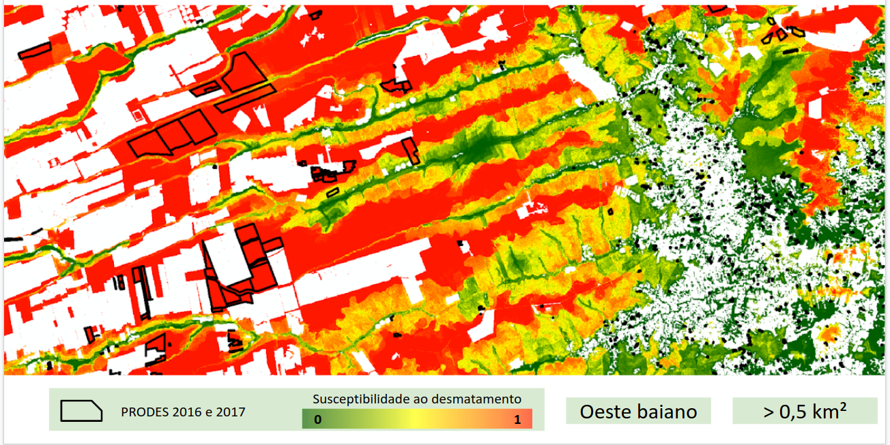
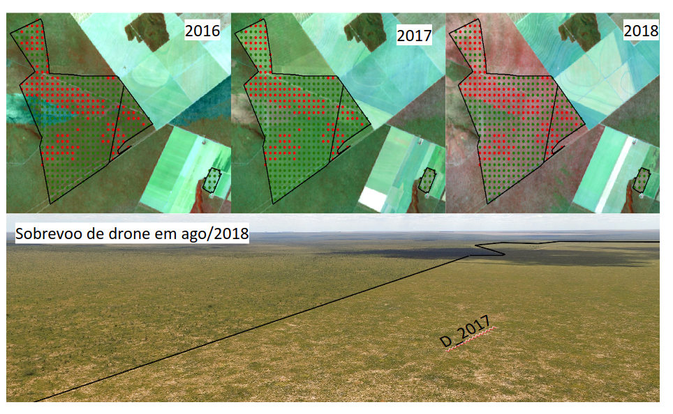

# Métricas de qualidade

## Dados de campo

No âmbito do projeto FIP Monitoramento, foram realizadas quatro atividades de campo com o propósito de avaliar os desmatamentos detectados pelo PRODES-Cerrado em 2016, 2017 e 2018. Foram utilizados formulários eletrônicos, GPS, drones e câmeras fotográficas. Destaca-se que foram selecionadas regiões com diferentes fitofisionomias, relevos, solos, condições climáticas e elementos socioeconômicos, com o propósito de buscar uma maior variabilidade de condições,. Posteriormente, houve uma inspeção visual em imagens históricas (2000-2017) das áreas visitadas para checagem se as mesmas já estavam antropizadas ano de detecção.

<i>Roteiro dos campos realizados no âmbito do projeto FIP Monitoramento</i>

No primeiro campo, que ocorreu entre 27/08 à 02/09 de 2018, foram visitados os estados do Piauí, Maranhão, Tocantins e Bahia. A equipe percorreu um total de 2.077 km, avaliando um 72 polígonos, sendo 26 com sobrevoos de drone. Foi constatado que 97% dos pontos visitados estavam antropizados. Observa-se na figura abaixo um talhão agrícola situado sobre um Latossolo Vermelho-Amarelo e cercada por remanescentes de Cerrado Denso no município de Corrente-PI. 

<i>Desmatamento detectado pelo PRODES-Cerrado no ano de 2017, visitado no 1º campo realizado.</i>

No segundo campo, que ocorreu entre 18/03 a 22/03 de 2019, foram visitados os estados de Goiás, Tocantins e Bahia. A equipe percorreu um total de 1951 km, avaliando 99 polígonos, com 32 com sobrevoos de drone realizados. Todos os pontos estavam antropizados. A figura abaixo revela um desmatamento de 8 km² no município de Dianópolis-TO. Apesar de ter sido detectado e realizado em 2017, conforme inspeção em imagens de satélite, foram observados tratores e madeiras sendo queimadas, indicando a ocorrência de um processo de supressão da vegetação secundária nesta área.

<i>Desmatamento detectado pelo PRODES-Cerrado no ano de 2017 e visitado durante o 2º campo realizado.</i>

No terceiro campo, que ocorreu em 13/07 a 19/07 de 2019, foram visitados os estados do Maranhão e Piauí. A percorreu um total de 2181 km, avaliando 144 polígonos e registrando 38 sobrevoos de drone. Neste campo, 98% das áreas estavam antropizadas. Observa-se na Figura 40 uma área localizada entre Alexandre Costa-MA e São João do Soter-MA, situada em uma região de ecótono conhecida como Mata de Cocais, e com uma alta incidência de pequenos desmatamentos pequenos (i.e., inferiores à 0,5 km²). Durante o campo realizado constatou-se nesta área uma alta quantidade de fragmentos de vegetação nativa compostos por formações florestais e com predomínio de palmeirais. Apesar do processo de antropização nesta região ser conduzido por pequenos desmatamentos, para extração de lenha e formação de pequenos pastos, também foram visitadas áreas desmatadas com detecções iguais ou superiores à 1 km, com pastagens formadas por B. brizantha e capim Mombaça. Em alguns pastos também foi observada uma grande quantidade de plantas invasoras, como ervas daninhas, além de áreas abandonadas com indícios de regeneração da vegetação nativa.

<i>Área com grande concentração de desmatamentos no estado do Maranhão.</i>

No quarto campo, realizado entre os dias 08 e 15 de novembro de 2019, nos Estados do Tocantins e de Goiás, foram visitadas 126 áreas detectadas pelos PRODES (anos de 2016 e 2017) e DETER (ano de 2019). A equipe percorreu um total de 1810 km, avaliando 126 polígonos, com 38 sobrevoos de drone. Neste campo, apenas uma área não se encontrava antropizada.

<i>Desmatamento detectado pelo PRODES-Cerrado, no ano de 2018, no município de Lagoa da Confusão (TO). Área destinada ao cultivo de arroz e circundada por vegetação nativa constituída de campos de murundus.</i>

De um total de 367‬ áreas visitadas em campo, 361‬ (98,3%) estavam antropizadas. O total de acertos por campo está registrado na figura abaixo. Além da validação realizada, os principais aspectos identificados e campo foram: detecções DETER-Cerrado verdadeiras; áreas desmatadas, porém sem uso consolidado e com presença de vegetação secundária; áreas agrícolas abandonadas após o desmatamento; presença de tratores em algumas áreas desmatadas.

<i>Desmatamentos validados em campo corretamente mapeados pelo PRODES-Cerrado e DETER-Cerrado como áreas antropizadas.</i>

## Validação amostral
TODO

## Contextualização geográfica

 Como subsídio à qualificação e contextualização espacial dos polígonos detectados a partir de 2016, foram criadas duas superfícies de susceptibilidade ao desmatamento, isto é, desmatamentos inferiores e superiores à 0,5 km² nomeados como desmatamentos grandes e pequenos respectivamente. Essas superfície foram desenvolvidas a partir de uma síntese e da verificação de influência de 11 variáveis (i.e. distância de áreas antrópicas; distância de rodovias; distância de silos e armazéns; categoria fundiária; tamanho da propriedade; textura e tipo de solo; geomorfologia, média anual da precipitação acumulada entre 2000-2015; declividade; altitude) nos desmatamentos ocorridos entre os anos de 2010 e 2015.

 Para este processo foi adotado o método de Weights of Evidence, implementado no software Dinamica EGO (SOARES-FILHO et al., 2009). Este produto é composto por um conjunto de valores numérico, entre 0 e 1, que indicam a susceptibilidade/probabilidade de uma determinada área no Cerrado ser desmatada. Conforme apresentado no relatório anterior, a criação destas superfícies foi definida com base nas diferentes respostas das variáveis aos desmatamentos grandes, associados à terras com alta aptidão agrícola, e pequenos, associados à terras com baixa aptidão agrícola.

<i>Procedimentos metodológicos para a criação das Superfícies de Susceptibilidade ao Desmatamento.</i>

Ao final, as superfícies geradas foram avaliadas a partir dos seus respectivos cruzamentos com os polígonos detectados no ano de 2016.

<i>Distribuição das áreas detectadas pelo PRODES-Cerrado, em 2016, em relação aos valores de susceptibilidade presentes na superfície gerada.</i>

O exemplo abaixo apresenta a superfície de susceptibilidade aos desmatamentos grandes no Oeste Baiano juntamente com os polígonos detectados pelo PRODES-Cerrado 2016 e 2017. É interessante observar que diversos polígonos com áreas grandes se encontram na região com alta susceptibilidade a desmatamentos grandes, enquanto desmatamentos com pequenas áreas estão localizados em área menos susceptíveis a desmatamentos maiores que 0,5 km². Com isto, pode-se observar a boa aderência do modelo em relação aos dados do PRODES-Cerrado.

<i>Superfície de Susceptibilidade a Desmatamentos superiores a 0,5 km² para o Oeste Baiano.</i>

Após a execução do modelo para todo o Cerrado, foi realizado o cruzamento das superfícies geradas com os polígonos do PRODES e DETER-Cerrado para os anos de 2016, 2017 e 2018. Para os polígonos do PRODES-Cerrado, foi observado que cerca de 51% dos polígonos estão em áreas com alta susceptibilidade a desmatamentos grandes o que representa uma área total de 3.496 km², de modo que 75% dessa área apresenta susceptibilidade superior a 50%. O mesmo ocorre também para os polígonos de desmatamento pequenos, que representam uma área total de 4.902 km² e 78% da área desses polígonos está inserida regiões com alta susceptibilidade a desmatamentos pequenos.

Da mesma forma, para os polígonos do DETER-Cerrado foi observado que apenas 14% dos polígonos estão em regiões com alta susceptibilidade a desmatamentos grandes, porém estes 14%, compõem um total de 2.855 km² e representam aproximadamente 54% de toda a área desmatada no período supracitado, o que atrai uma atenção especial para este caso, pois embora a quantidade de desmatamentos seja menor, o seu impacto é significativo para o contexto. Para os polígonos de desmatamento pequenos, que representam 87% do total de polígonos e correspondente a 2.437 km², 71% destes polígonos se encontram em regiões com pelo menos 50% de susceptibilidade a desmatamentos pequenos, o que mostra uma boa acurácia do método em proporcionar um indicativo para desmatamentos futuros, fornecendo assim um guia viável para órgãos governamentais intensificarem a fiscalização em regiões com alta susceptibilidade de desmatamentos.

<i>Superfícies de Susceptibilidade a Desmatamentos superiores e inferiores a 0,5 km² para o bioma Cerrado.</i>

## Contextualização espectro temporal

A implementação da métrica de conversão da cobertura nativa inicialmente considerou três algoritmos: Bfast01 (DE JONG et.al., 2013) e Bfast-Monitor (VERBESSELT et. al., 2012) para as séries temporais de índice de vegetação MODIS entre 2000 e 2017, e o algoritmo LandTrendR (KENNEDY et al., 2010) para as séries temporais Landsat entre 1985 e 2017. O algoritmo Bfast-Monitor apresentou as melhores taxas de acerto na detecção de rupturas nas séries temporais de 2016 e 2017 para polígonos maiores que 0,25 km², e portanto, foi escolhido como algoritmo padrão para implementação desta métrica. A implementação desta métrica considerou o centróide de todos os polígonos PRODES-Cerrado 2017.

Após a execução do Bfast-Monitor em todos os pixels MODIS contidos nos polígonos PRODES-Cerrado, entre 2016 e 2018 (i.e. 525.038), foi observado que cerca de 82% dos polígonos apresentaram pixels com quebras em suas séries temporais, e dentre estes, polígonos com área de pelo menos 0,25 km² apresentaram mais de 50% dos pixels com quebras, um indicativo da eficiência deste método em detectar desmatamentos grandes. Em contrapartida, os polígonos que apresentaram até 25% de pixels com quebra representam cerca de 46% do total de polígonos do PRODES-Cerrado, porém este valor é equivalente a uma área total de 2.369 km², que representa apenas 11% do total desmatamento entre 2016 e 2018.

<i>Resultado da execução do Bfast-Monitor para um polígono PRODES-Cerrado em Mateiros-TO e fotografia obtida com sobrevoo de drone durante a visita de campo.</i>

A figura acima apresenta um exemplo de polígono de desmatamento detectado pelo PRODES-Cerrado em 2017 e também confirmado automaticamente pelo Bfast-Monitor. Nela é possível observar um polígono com uma área total de 18 km² no município de Mateiros-TO, onde sua imagem MODIS apresenta 350 pixels sendo que 218 destes sofreram rupturas.

Por fim, é importante ressaltar que do total de 21.869 km² de áreas desmatadas entre 2016 e 2018 no bioma Cerrado, o Bfast-Monitor foi capaz de identificar 15.550 km² de polígonos que apresentaram pelo menos 50% de quebras em suas séries temporais, o que representa ~71% do total. Nas demais áreas também foram identificados pixels com quebras, porém em menor proporção, o que indica a presença de desmatamento de tamanho inferior a 0,25 km², o que devido a resolução do pixel MODIS se torna mais difícil de ser identificado. De forma geral, foi possível observar uma convergência entre os resultados gerados pelo Bfast-Monitor e os dados divulgados pelo PRODES-Cerrado.

