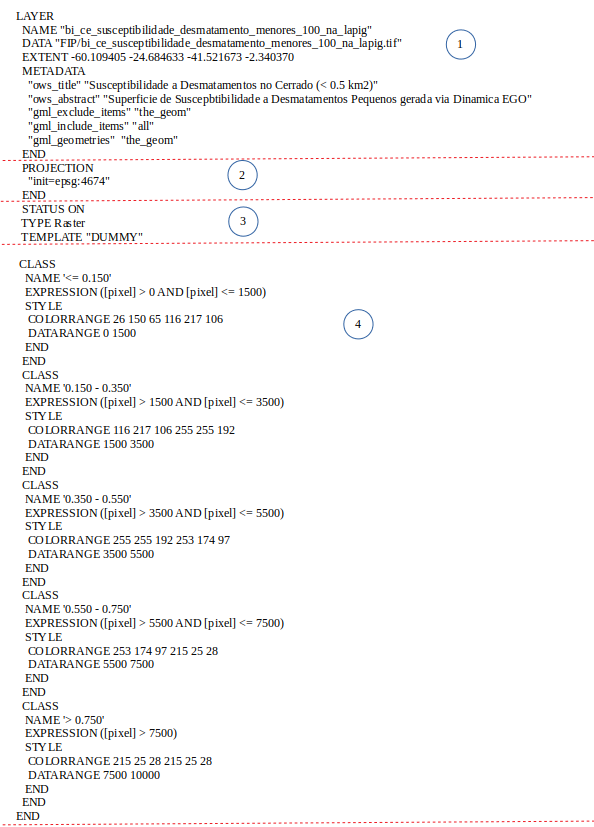

# Servidor de Mapas
O OWS Server é responsável por encaminhar as requisições ao Mapserver a fim de gerar a visualização dos dados geográficos e organizar para que as imagens geradas sejam armazenadas em cache para melhorar o desempenho em requisições futuras. O código-fonte para o OWS Server se encontra no repositório [Github](https://github.com/lapig-ufg/lapig-maps) do LAPIG/UFG.


Devido a facilidade em lidar com a arquitetura de WebServices, o código em NodeJS foi criado para também realizar o controle de cache das imagens processadas pelo Mapserver. Para tal, uma customização foi criada a fim de se associar uma chave (`cacheKey`) a cada imagem de cada camada configurada no Mapserver. Esta imagem é armazenada em um sistema de arquivos (pasta) chamada `OWS-Cache`, de modo que, em futuras requisições para uma determinada imagem, é verificada se a imagem já existe na `OWS-Cache` ou não. Caso exista, a imagem é retornada na requisição, caso não exista, o código NodeJS envia a requisição para o Mapserver processar e gerá-la, armazenando-a no `OWS-Cache`. O método que realiza esta verificação é o método `OgcServer.ows` que faz parte do Controlador da aplicação em NodeJS.

    src/controllers/ogc-server.js
``` js
OgcServer.ows = function(request, response) {
	var params = Internal.getParams(request);
	response.setHeader("Access-Control-Allow-Origin", "*");

    Internal.setHeaders(params, request, response);
		var cacheKey = Internal.getCacheKey(params);
		
		if(cacheKey && (config['cacheEnable'] || Internal.isWmsGetCap(params)) ) {
			Internal.doRequestWithCache(cacheKey, params, response);
		} else {
			Internal.doRequest(params, response);
		}
}
```
Esta customização pode ser encontrada no código NodeJS no repositório específico para o código NodeJS no [Github](https://github.com/lapig-ufg/lapig-maps/tree/master/src/ows).

## Serviço de interoperabilidade 
A interoperabilidade é uma tecnologia que possibilita o compartilhamento de dados entre sistemas, independente do local físico de armazenamento e da tecnologia utilizada em cada servidor de dados.
No Geoprocessamento, a interoperabilidade pode ser aplicada para promover o intercâmbio de dados geográficos entre diferentes softwares de SIG.
O OCG (Open Geospatial Consortium, Inc.) é uma organização que tem como objetivo principal viabilizar o intercâmbio de dados geográficos através da criação de especificações que simplificam a interação entre diferentes fontes de dados. Desta forma, os principais serviços especificados pela OGC são:

+ _**Web Map Service - WMS**_: produz mapas dinâmicos partir de dados georreferenciados em um servidor remoto. Esses mapas são geralmente apresentados no formato de figura (PNG, JPEG ou GIF). Também é possível consultar os atributos dos elementos que compõem os mapas. 
+ _**Web Feature Service - WFS**_: define um serviço para recuperação de objetos (*features*) espaciais. Diferentemente do WMS, o WFS devolve o dado e não uma "figura" do dado. 
+ _**Tile Map Service - TMS**_: define um serviço que fornece imagens de dados geográficos a partir de URLs para porções (*tiles*) definidas pelo conjunto de coordenadas {z} {x} {y} do dado georeferenciado. O TMS é mais amplamente suportado pelos navegadores Web. 
    - _**UTFGrid**_: usam uma combinação de codificação JSON e arquivos grid ASCII que estão ao lado de cada bloco de imagem do mapa. Desta forma, uma tabela de pesquisa em JSON fornece o conjunto completo de atributos que viabiliza a devolução de dados sobre aquele grid, permitindo interatividade com o mapas.

Desta forma, uma representação visual da interoperabilidade entre serviços pode ser encontrada no [link](http://wiki.dpi.inpe.br/lib/exe/fetch.php?media=cap349_2009:interoperabilidade_2010.pdf) e apresentada abaixo.


Por fim, a tabela abaixo apresenta os tipos de serviços fornecidos pelo Cerrado DPAT bem como suas URLs de acesso, onde `<ows_host>` representa o domínio onde o OWS Server está hospedado e `<layername>` representa a camada configurada no Mapfile:

| Tipo de Requisição | Fonte               | URL                                                                                                                                                                                                                                                       | Descrição                                                                                                                                                                                                                                                                                                                                                                                                 |
| ------------------ | ------------------- | --------------------------------------------------------------------------------------------------------------------------------------------------------------------------------------------------------------------------------------------------------- | --------------------------------------------------------------------------------------------------------------------------------------------------------------------------------------------------------------------------------------------------------------------------------------------------------------------------------------------------------------------------------------------------------- |
| WMS                | OWS Server          | `https://<ows_host>/ows?TRANSPARENT=TRUE&VERSION=1.1.1&SERVICE=WMS&REQUEST=GetLegendGraphic&layer=<layername>&format=image/png`                                                                                                                           | Retorna uma imagem com a legenda da camada (`<layername>`) especificada no [link](https://drive.google.com/file/d/1gO9dMdxy15wIK5gIIdlkBKlgy-D7JNHH/view)..                                                                                                                                                                                                                                               |
| WMS                | OWS Server          | `https://<ows_host>/ows?SERVICE=WMS&REQUEST=GetMap&VERSION=1.1.1&layers=<layername1>,<layername2>, ... &bbox=<bounding_box>&TRANSPARENT=TRUE&srs=EPSG:4674&width=768&height=768&format=image/png&styles=&ENHANCE=TRUE&MSFILTER=<sql_applied_on_MSFILTER>` | Retorna uma imagem com a composição de camadas identificadas pelas layers, com o foco no enquadramento para a geometria definida pela função [ST_EXTENT](https://postgis.net/docs/ST_Extent.html) do Postgis. Por fim, o parâmetro `<sql_applied_on_MSFILTER>` especifica a query que deverá ser aplicada para filtrar dados em todas as camadas que possuam `MSFILTER` em sua configuração no Mapserver. |
| TMS                | OWS Server          | `https://<ows_host>/ows?layers=<layername>&MSFILTER=<sql_applied_on_MSFILTER>&mode=tile&tile=<{z}>+<{x}>+<{y}>&tilemode=gmap&map.imagetype=png`                                                                                                           | Retorna uma imagem com a composição de camadas identificadas pelas layers, com o foco no enquadramento para a geometria definida pela função [ST_EXTENT](https://postgis.net/docs/ST_Extent.html) do Postgis. Por fim, o parâmetro `<sql_applied_on_MSFILTER>` especifica a query que deverá ser aplicada para filtrar dados em todas as camadas que possuam `MSFILTER` em sua configuração no Mapserver. |
| TMS                | Mapbox              | `https://api.tiles.mapbox.com/v4/mapbox.light/<{z}>/<{x}>/<{y}>.png?access_token=<chave_de_acesso>.`                                                                                                                                                      | Retorna a composição do mapa Geopolítico fornecido pela [Mapbox](https://www.mapbox.com/)                                                                                                                                                                                                                                                                                                                 |
| TMS                | Google Maps         | `https://mt{0-3}.google.com/vt/lyrs=m&x=<{x}>&y=<{y}>&z=<{z}>`                                                                                                                                                                                            | Retorna a composição de imagens do mapa fornecido pela API do GoogleMaps.                                                                                                                                                                                                                                                                                                                                 |
| TMS                | World Shaded Relief | `https://server.arcgisonline.com/ArcGIS/rest/services/World_Shaded_Relief/MapServer/tile/<{z}>/<{y}>/<{x}>`                                                                                                                                               | Retorna a composição de mapas de Relevo fornecido pelo ArcGis.                                                                                                                                                                                                                                                                                                                                            |
| UTFGrid            | OWS Server          | `https://<ows_host>/ows?layers=<layername>&MSFILTER=<sql_applied_on_MSFILTER>&mode=tile&tile=<{z}>+<{x}>+<{y}>&tilemode=gmap&map.imagetype=utfgrid`                                                                                                       | Retorna os dados referentes aos atributos definidos na camada fornecida pelo OWS Server para o <layername> especificado na requisição para o tile {z},{x},{y}.                                                                                                                                                                                                                                            |

                                                                                                                                                                                                                                                                                                             


## Processo de atualização
Um dado geográfico é disponbilizado pelo Mapserver como uma camada. Para tal, o Mapserver utiliza um arquivo de configuração para renderização de dados geoespaciais chamado de Mapfile. O principal objetivo do Mapfile é definir as camadas que podem ser "desenhadas" pelo Mapserver, como ler estes dados (uma vez que eles podem ser vetores ou matrizes) e como renderizá-los, definindo cores, símbolos, rótulos, legendas e etc. Desta forma, o Mapfile inclui informações sobre:

+ Quais camadas devem ser renderizadas;
+ Onde está o foco geográfico do mapa;
+ Qual projeção está sendo usada;
+ Qual o formato gráfico de saída;
+ Configuração da legenda e a escala utilizada;

A figura abaixo apresenta o Mapfile da camada dos desmatamentos PRODES-Cerrado presente no Cerrado DPAT. Esta mesma figura pode representar um exemplo prático para criação de um Mapfile com conexão com Banco de Dados e assim obter dados em formato vetorial. Portanto, segue a especificação de cada item destacado na imagem:


1. Apresenta o nome da camada, bem como a fonte de onde este dado será carregado. No exemplo este dado é acessado pela comunicação com Postgis devidamente autenticado;

2. Determina o foco do dado para a extensão do Cerrado;

3. Apresenta os metadados da camada;

4. Cria uma variável para validação e filtragem dos dados por meio do [runtime substitution](https://mapserver.gis.umn.edu/pl/cgi/runsub.html) 

5. Define a projeção do dado apresentado;

6. Define o tipo do dado apresentado;

7. Define a estrutura dos dados que são enviados via UTFGrid. Para tal é importante definir um identificador único (UTFITEM) e os dados a serem enviados através da tupla {"chave_acesso" : "coluna_banco_dados"} em UTFDATA que irão compor o JSON gerado.

8. Define uma classificação para os dados a fim de customizar a coloração de acordo com um critério. A classificação estabelecida também irá compor a legenda.


Um segundo tipo de camada de dados presente no Cerrado DPAT é oriundo de dados matriciais, ou seja, imagens TIF. Portanto, para criação de um Mapfile para um TIF é necessário alterar as sessões (1) - onde deve-se apresentar a localização do arquivo TIF no sistema de arquivos através da diretiva 'DATA'; (6) - alterar para o tipo de dados Raster e (8), onde o critério para classificação se dá de acordo com o valor do pixel em um ponto. Portanto, o Mapfile para arquivos matriciais se dá conforme imagem abaixo.




Por fim, o Mapfile utilizado para disponibilizar todas as camadas presentes no Cerrado DPAT está na pasta compartilhada do projeto no [link](https://drive.google.com/file/d/1gO9dMdxy15wIK5gIIdlkBKlgy-D7JNHH/view?usp=sharing).

## Deploy
TODO (execução em Docker)