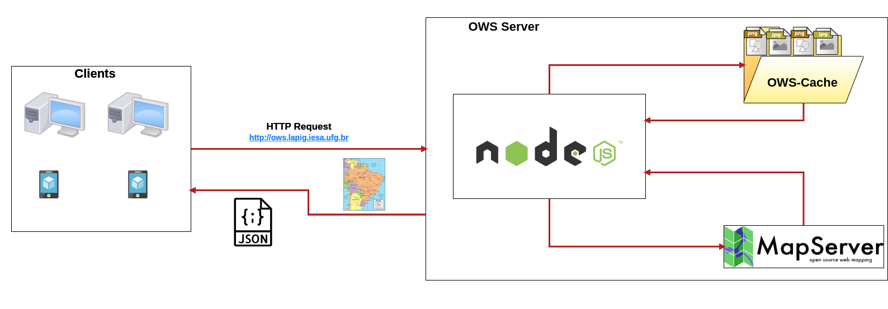
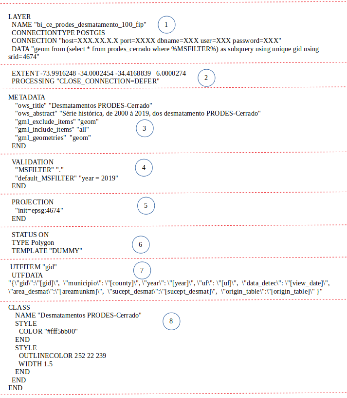

# Servidor de Mapas
O OWS Server é responsável por encaminhar as requisições ao Mapserver a fim de gerar a visualização dos dados geográficos e organizar para que as imagens geradas sejam armazenadas em cache para melhorar o desempenho em requisições futuras. O código-fonte para o OWS Server se encontra no repositório [Github](https://github.com/lapig-ufg/lapig-maps) do LAPIG/UFG.

## Serviço de interoperabilidade 
A interoperabilidade é uma tecnologia que possibilita o compartilhamento de dados entre sistemas, independente do local físico de armazenamento e da tecnologia utilizada em cada servidor de dados.
No Geoprocessamento, a interoperabilidade pode ser aplicada para promover o intercâmbio de dados geográficos entre diferentes softwares de SIG.
O OCG (Open Geospatial Consortium, Inc.) é uma organização que tem como objetivo principal viabilizar o intercâmbio de dados geográficos através da criação de especificações que simplificam a interação entre diferentes fontes de dados. Desta forma, os principais serviços especificados pela OGC são:

+ _**Web Map Service - WMS**_: produz mapas dinâmicos partir de dados georreferenciados em um servidor remoto. Esses mapas são geralmente apresentados no formato de figura (PNG, JPEG ou GIF). Também é possível consultar os atributos dos elementos que compõem os mapas. 
+ _**Web Feature Service - WFS**_: define um serviço para recuperação de objetos (*features*) espaciais. Diferentemente do WMS, o WFS devolve o dado e não uma "figura" do dado. 
+ _**Tile Map Service - TMS**_: define um serviço que fornece imagens de dados geográficos a partir de URLs para porções (*tiles*) do todo. O TMS é mais amplamente suportado pelos navegadores Web. 

Desta forma, uma representação visual da interoperabilidade entre serviços pode ser encontrada no [link](http://wiki.dpi.inpe.br/lib/exe/fetch.php?media=cap349_2009:interoperabilidade_2010.pdf) e apresentada abaixo.

## Processo de atualização
Um dado geográfico é disponbilizado pelo Mapserver como uma camada. Para tal, o Mapserver utiliza um arquivo de configuração para renderização de dados geoespaciais chamado de Mapfile. O principal objetivo do Mapfile é definir as camadas que podem ser "desenhadas" pelo Mapserver, como ler estes dados (uma vez que eles podem ser vetores ou matrizes) e como renderizá-los, definindo cores, símbolos, rótulos, legendas e etc. Desta forma, o Mapfile inclui informações sobre:

+ Quais camadas devem ser renderizadas;
+ Onde está o foco geográfico do mapa;
+ Qual projeção está sendo usada;
+ Qual o formato gráfico de saída;
+ Configuração da legenda e a escala utilizada;

A figura abaixo apresenta o Mapfile da camada dos desmatamentos PRODES-Cerrado presente no Cerrado DPAT. Portanto, segue a especificação de cada item destacado na imagem:

    (1) Apresenta o nome da camada, bem como a fonte de onde este dado será carregado. No exemplo este dado é acessado pela comunicação com Postgis devidamente autenticado;

    (2) Determina o foco do dado para a extensão do Cerrado;

    (3) Apresenta os metadados da camada;

    (4) Cria uma variável para validação e filtragem dos dados por meio do [runtime substitution](https://mapserver.gis.umn.edu/pl/cgi/runsub.html) 

    (5) Define a projeção do dado apresentado;

    (6) Define o tipo do dado apresentado;

    (7) Define uma classificação para os dados a fim de customizar a coloração de acordo com um critério. A classificação estabelecida também irá compor a legenda.

O Mapfile utilizado para disponibilizar todas as camadas do Cerrado DPAT está na pasta compartilhada do projeto no [link](https://drive.google.com/drive/folders/1JYhWBHPOZAPKHjJxp-gzA1bGABwctAWk).

## Deploy
TODO (execução em Docker)