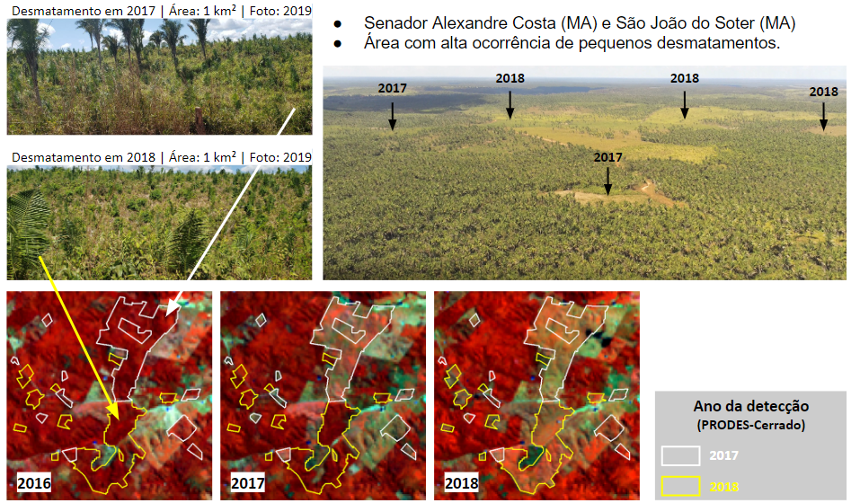

# Métricas de avaliação

## Dados de campos

### Realização das atividades de campo

No âmbito do projeto FIP Monitoramento, foram realizadas quatro atividades de campo com o propósito de avaliar os desmatamentos detectados pelo PRODES-Cerrado em 2016, 2017 e 2018. Foram utilizados formulários eletrônicos, GPS, drones e câmeras fotográficas. Destaca-se que foram selecionadas regiões com diferentes fitofisionomias, relevos, solos, condições climáticas e elementos socioeconômicos, com o propósito de buscar uma maior variabilidade de condições,. Posteriormente, houve uma inspeção visual em imagens históricas (2000-2017) das áreas visitadas para checagem se as mesmas já estavam antropizadas ano de detecção.


No primeiro campo, que ocorreu entre 27/08 à 02/09 de 2018, foram visitados os estados do Piauí, Maranhão, Tocantins e Bahia. A equipe percorreu um total de 2.077 km, avaliando um 72 polígonos, sendo 26 com sobrevoos de drone. Foi constatado que 97% dos pontos visitados estavam antropizados. Observa-se na figura abaixo um talhão agrícola situado sobre um Latossolo Vermelho-Amarelo e cercada por remanescentes de Cerrado Denso no município de Corrente-PI. 


No segundo campo, que ocorreu entre 18/03 a 22/03 de 2019, foram visitados os estados de Goiás, Tocantins e Bahia. A equipe percorreu um total de 1951 km, avaliando 99 polígonos, com 32 com sobrevoos de drone realizados. Todos os pontos estavam antropizados. A figura abaixo revela um desmatamento de 8 km² no município de Dianópolis-TO. Apesar de ter sido detectado e realizado em 2017, conforme inspeção em imagens de satélite, foram observados tratores e madeiras sendo queimadas, indicando a ocorrência de um processo de supressão da vegetação secundária nesta área.


No terceiro campo, que ocorreu em 13/07 a 19/07 de 2019, foram visitados os estados do Maranhão e Piauí. A percorreu um total de 2181 km, avaliando 144 polígonos e registrando 38 sobrevoos de drone. Neste campo, 98% das áreas estavam antropizadas. Observa-se na Figura 40 uma área localizada entre Alexandre Costa-MA e São João do Soter-MA, situada em uma região de ecótono conhecida como Mata de Cocais, e com uma alta incidência de pequenos desmatamentos pequenos (i.e., inferiores à 0,5 km²). Durante o campo realizado constatou-se nesta área uma alta quantidade de fragmentos de vegetação nativa compostos por formações florestais e com predomínio de palmeirais. Apesar do processo de antropização nesta região ser conduzido por pequenos desmatamentos, para extração de lenha e formação de pequenos pastos, também foram visitadas áreas desmatadas com detecções iguais ou superiores à 1 km, com pastagens formadas por B. brizantha e capim Mombaça. Em alguns pastos também foi observada uma grande quantidade de plantas invasoras, como ervas daninhas, além de áreas abandonadas com indícios de regeneração da vegetação nativa.



No quarto campo, realizado entre os dias 08 e 15 de novembro de 2019, nos Estados do Tocantins e de Goiás, foram visitadas 126 áreas detectadas pelos PRODES (anos de 2016 e 2017) e DETER (ano de 2019). A equipe percorreu um total de 1810 km, avaliando 126 polígonos, com 38 sobrevoos de drone. Neste campo, apenas uma área não se encontrava antropizada.

. Área destinada ao cultivo de arroz e circundada por vegetação nativa constituída de campos de murundus.")

De um total de 367‬ áreas visitadas em campo, 361‬ (98,3%) estavam antropizadas. O total de acertos por campo está registrado na figura abaixo. Além da validação realizada, os principais aspectos identificados e campo foram: detecções DETER-Cerrado verdadeiras; áreas desmatadas, porém sem uso consolidado e com presença de vegetação secundária; áreas agrícolas abandonadas após o desmatamento; presença de tratores em algumas áreas desmatadas.


### Processo de atualização

Após a execução das viagens de campo, deve-se organizar as mídias digitais obtidas em três pastas principais: `fotos_camera`, `fotos_drone` e `videos_drone`. Internamente deverá conter subpastas com identificadores de qual visita de campo está sendo documentada. Por exemplo, a subpasta `Campo_01` é referente as mídias obtidas durante a primeira validação de campo. Dentro da pasta de `Campo`, deve-se criar subpastas com o identificador do `Trecho` onde foi retirada a fotografia ou vídeo de drone. E por fim, dentro da pasta referente ao Trecho, deve-se criar subpastas com o `Localizador` único de cada mídia. 

Portanto, a imagem abaixo apresenta estrutura de pastas e arquivos referente as fotos retiradas do solo durante a visita ao primeiro campo, ao atravessar o trecho anotado como '1A' e localizador único definido como Placemark 'numero'.


Após organização dos arquivos em pastas, uma planilha para controle e organização das imagens. Um exemplo de arquivo .csv que realiza a organização para o Campo_01, trecho '1A' pode ser encontrado neste [link](https://github.com/lapig-ufg/d-pat/blob/master/src/server/scripts/campo/exemplo_org_campo.csv). Conforme, pode ser observado no exemplo, é importante que o arquivo csv apresente o seguinte cabeçalho:

``` csv
id,Campo,Trecho,Localizado,Sobrevôo,Data,Latitude,Longitude,Classe,Obs,Cobertura
```

Uma vez que o arquivo .csv esteja preenchido com a informação de todos os campos. Deve-se realizar a inserção do mesmo no banco de dados, o que pode ser alcançado pela execução do seguinte comando:

``` sh
psql -d <db_name> --user=<db_user> -c "COPY pontos_campo FROM '<caminho_para_o_arquivo_csv>.csv' delimiter ',' CSV [HEADER];"
```

Após importação no banco de dados, é necessária a criação da geometria de ponto na tabela `pontos_campo`.

``` sql
UPDATE pontos_campo
SET geom = ST_SetSRID(ST_MakePoint(lon, lat), 4674)
WHERE geom is null;
```

Em seguida é necessário realizar o cruzamento entre o PRODES e DETER-Cerrado em relação aos pontos visitados para associar o ponto visitado em campo com um polígono de desmatamento.

``` sql
UPDATE pontos_campo 
SET prodes_id = p.gid
FROM prodes_cerrado p
WHERE pontos_campo.prodes_id IS NULL
AND ST_INTERSECTS(pontos_campo.geom, p.geom)
```

``` sql
UPDATE pontos_campo 
SET deter_id = d.gid
FROM deter_cerrado d
WHERE pontos_campo.deter_id IS NULL
AND ST_INTERSECTS(pontos_campo.geom, d.geom)
```

Geralmente as mídias digitais recolhidas durante a validação de campo (principalmente as obtidas durante o sobrevôo de drone) são compostas por arquivos pesados. Para tal, aplica-se um script para compresão dos mesmos a fim de facilitar a sua disponibilização no Cerrado DPAT. O script a ser executado é o [`compress_videos.sh`](https://github.com/lapig-ufg/d-pat/blob/master/src/server/scripts/campo/compress_videos.sh), porém antes de executar é necessário alterar as linhas 5 e 6 com o caminho até o diretório dos vídeos e fotos de drone respectivamente.

``` sh
./compress_videos.sh
```

A versão atual do script `compress_videos.sh` não comporta a compresão de imagens de câmera, porém caso desejem comprimir também estas, basta descomentar as linhas 7 e 42-47.

Em seguida, a fim de realizar uma organização nas fotos comprimidas em um diretório único chamado `dados_padronizados`, adequando corretamente os nomes dos arquivos de acordo com o padrão descrito no arquivo .csv, deve-se executar o script [`organize_fotos.js`](https://github.com/lapig-ufg/d-pat/blob/master/src/server/scripts/campo/organize_fotos.js). Antes de executar, confira as linhas 38 em relação a localização do arquivo .csv e caso tenha-se comprimido as fotografias de câmera, verificar também as linhas 52 e 53.

```
node organize_fotos.js
```

Por fim, deve-se configurar o caminho para a pasta `dados_padronizados` no arquivo de configuração `.env` no *Application Server* utilizando diretive `FIELD_DATA_DIR`. Por exemplo:

```
FIELD_DATA_DIR=/media/campo/dados_padronizados
```


## Dados de validação amostral 
TODO

### Sorteio de novos pontos
TODO

### Inspeção no TVI
TODO

### Processo de atualização

Após o processo de Inspeção no TVI, um arquivo .csv com a consolidação das classes pontos é criado com a seguinte estrutura de cabeçalho e considerando ';' como separador: 

``` csv
gid;lon;lat;d_2000;d_2001;d_2002;d_2003;d_2004;d_2005;d_2006;d_2007;d_2008;d_2009;d_2010;d_2011;d_2012;d_2013;d_2014;d_2015;d_2016;d_2017;d_2018;d_2019;classe
```

Os campos lon e lat deverão apresentar a longitude e latitude do ponto inspecionado. As colunas 'd_20**' deverão apresentar a classe atribuída ao ponto no respectivo ano e o campo 'classe' deverá apresentar a classe final consolidada após a inspeção, podendo ser ela Natural, Água ou o ano apontado como desmatamento pela inspeção visual.

Após revisão do arquivo .csv, deve-se inserir os resultados alcançados pela validação amostral através do script [insert_validacao_amostral.js](https://github.com/lapig-ufg/d-pat/blob/master/src/server/scripts/bfast/insert_validacao_amostral.js). Antes de executar o script, deve-se alterar a linha 9 para a localização do arquivo .csv. Para execução da inserção, faça:

``` js
node insert_validacao_amostral.js
```

Após inserção dos pontos no banco de dados, é necessária a criação das geometrias dos pontos, portanto execute o seguinte comando SQL:

``` sql
UPDATE validacao_amostral 
SET geom = ST_Transform(ST_SetSRID(ST_MakePoint(cast(lon as float), cast(lat as float)), 4674),4674)
WHERE geom is null;
```

Em seguida, deve-se realizar a intersecção dos pontos inseridos com os polígonos de desmatamento PRODES-Cerrado. Para tal, execute o seguinte comando SQL:

``` sql
UPDATE validacao_amostral 
SET prodes_id = p.gid
FROM prodes_cerrado p
WHERE validacao_amostral.prodes_id IS NULL
AND ST_INTERSECTS(validacao_amostral.geom, p.geom)
```

Por fim, deve-se executar duas queries para anotar quais pontos foram consolidados como desmatamento ou não através da atribuição de valor ao campo `aux_desmat`, caso seja detectado desmatamento atribui-se `1`, caso contrário `0` :

``` sql
UPDATE validacao_amostral
SET aux_desmat = 1
WHERE aux_desmat is null AND classe != 'AGUA' AND classe != 'NATURAL' AND classe != 'NAO_OBSERVADO'
```

Após a atribuição do valor 1 aos polígonos que foram detectados em áreas desmatadas, sobraram apenas pontos que foram anotados com a classe 'AGUA', 'NATURAL' ou 'NAO_OBSERVADO' de modo que estes pontos estão com valor `null` para o campo `aux_desmat`, portanto: 

``` sql
UPDATE validacao_amostral
SET aux_desmat = 0
WHERE aux_desmat is null
```


### Cálculo de acurácia (tabela)
TODO

## Análise automática
TODO

### Execucação do BFast-Monitor

Para atualização do Bfast-Monitor, é necessário três coisas:

1. Um Shapefile com os pixels MODIS filtrados para as áreas onde se deseja verificar se houve quebras na série temporal.
2. Um arquivo .TIF com toda a série temporal MODIS que pode ser gerado pelo projeto [MODIS Data Cube](https://github.com/lapig-ufg/mdc).
3. Os scripts `bfast.R` e `maxmin.R`, ambos inseridos na pasta [scripts/bfast](https://github.com/lapig-ufg/d-pat/tree/master/src/server/scripts/bfast) no repositório do Github.


#### Criação do Shapefile com os Pixels MODIS
Primeiramente, é importante informar que utilizamos a tabela `pixel_modis` no banco de dados que contém todos os pixels MODIS para a extensão do Cerrado, sendo assim necessária a filtragem para apenas os pixels MODIS que se encontram dentro das áreas desmatadas de interesse. 

Este filtro pode ser alcançado através da construção de uma View no banco de dados com os polígonos PRODES-Cerrado de interesse. Para exemplificar, criamos uma View que filtram os polígonos PRODES-Cerrado detectados em 2019 com o comando SQL abaixo:

``` sql
CREATE OR REPLACE VIEW public.prodes_2019 AS 
 SELECT prodes_cerrado.gid,
    prodes_cerrado.uid,
    prodes_cerrado.origin_gid,
    prodes_cerrado.pathrow,
    prodes_cerrado.view_date,
    prodes_cerrado.source,
    prodes_cerrado.classname,
    prodes_cerrado.areamunkm,
    prodes_cerrado.county,
    prodes_cerrado.uf,
    prodes_cerrado.geom,
    prodes_cerrado.sucept_desmat,
    prodes_cerrado.sucept_desmat_peq,
    prodes_cerrado.sucept_desmat_grd,
    prodes_cerrado.bfm_pct,
    prodes_cerrado.year,
    prodes_cerrado.lat,
    prodes_cerrado.long,
    prodes_cerrado.classefip,
    prodes_cerrado.cd_geocmu
   FROM prodes_cerrado
  WHERE prodes_cerrado.year = 2019;
```

Após a criação da View `prodes_2019`, é necessária a criação de um Shapefile com os pixels MODIS que intersectam os polígonos de desmatamento, contendo os seguintes atributos: {lon, lat, seq_id}, que representam a longitude e latitude do pixel e um identificador único do polígono onde foi extraído o ponto. O Shapefile é criado pelo comando shell abaixo:

``` sh
$ pgsql2shp -f <filename.shp> -h <hostname> -u <db_user> -P <db_password> <db_name> "select ST_X(pixel.geom) as lon, ST_Y(pixel.geom) as lat, p.gid as seq_id, pixel.geom as geom from pixel_modis pixel inner join prodes_2019 p on ST_INTERSECTS(p.geom, pixel.geom)"
```
O comando acima deverá criar um arquivo `filename.shp` com os pixels MODIS para os desmatamentos PRODES-Cerrado 2019 no local onde foi executado. 

#### Execução do MDC e criação da série MODIS

Inicialmente é necessário realizar o download do projeto [MDC](https://github.com/lapig-ufg/mdc). Em seguida, deve-se instalar todas as dependências listadas no projeto. Em seguida, extraia o arquivo `MRT.zip` e altere o parâmetro `path_mrt` no arquivo `mdc/src/conf/datasources.conf` para a localização da pasta extraída. 


Para iniciar o processamento da série temporal, execute os passos definidos no Readme.md do projeto MDC, e por fim, execute o comando abaixo que deverá criar toda a série temporal para o Brasil do período de 01 de Janeiro de 2000 até 01 de Janeiro de 2020. Portanto, para datas futuras, deve-se alterar os parâmetros `-s` e `-e`.

``` python
$ python sits.py -d modis -p MOD13Q1.006 -r brasil -s 2000-01-01 -e 2020-01-01
```

O processamento acima irá criar diversos arquivos .TIF na pasta. Em seguida é necessário organizar todos os arquivos .tif em uma pasta única. Fora da pasta dos arquivos, deve-se criar um arquivo .txt listando todos os arquivos .tif gerados, portanto pode-se executar os seguintes comandos no bash:

``` sh
$ touch mod13q1_ndvi_list.txt
$ ls <pasta_com_arquivos_tif>/ > mod13q1_ndvi_list.txt
```

Em seguida, acesse a pasta com os TIFs. Inicialmente é necessário descobrir qual o valor do parâmetro NoData para os arquivos gerados. Para tal execute o seguinte comando:

``` sh
$ gdalinfo nomedoarquivo.tif
```

Após verificar o valor do NoData, execute o comando abaixo para geração do arquivo VRT da série temporal:

``` sh
$ gdalbuildvrt -srcnodata <NoData_value> -separate -input_file_list ../mod13q1_ndvi_list.txt ../<nome_arquivo_VRT>.vrt
```

Por fim, exeute o comando abaixo para criação de um arquivo único TIF, também conhecido como BigTIF. Vale ressaltar que o comando abaixo possui um tempo considerável de processamento, portanto é aconselhável executá-lo em segundo plano com a ajuda do nohup.

``` sh
$ nohup gdal_translate -co TILED=YES -co COMPRESS=lzw -co BIGTIFF=YES -co INTERLEAVE=PIXEL ../<nome_arquivo_VRT>.vrt ../<nome_arquivo_TIF>.tif > saida.out &
```


#### Execução dos scripts de atualização do Bfast

Após a criação da série MODIS para o Brasil, é necessária a execução do algoritmo Bfast-Monitor para os pixels filtrados. Primeiramente é necessário alterar o arquivo `bfast.R` na linha 38 (descrita abaixo), indicando corretamente a localização do arquivo com a série MODIS processada.

``` R
ndvi <- brick("<localização_arquivo_serie_MODIS.tif>")
```

Em seguida, deve-se executar o script `bfast.R` (que importa o script `maxmin.R` para normalização dos dados), informando os parâmetros com a localização do Shapefile criado e quantos pixels MODIS serão analisados, conforme o exemplo abaixo, que indica a localização do shapefile `modis_prodes_2019_shp` e que deverão ser analisados dos pixels 1 até o 123513 (quantidade total de pixels no Shapefile):

``` sh
Rscript bfast.R <path_to_modis_prodes_2019.shp> 1 123513
```

Este processamento irá resultar em um arquivo .csv nomeado `result.csv`. Por fim, basta importar o arquivo .csv no banco de dados utilizando o script [`insert_bfast_db.js`](https://github.com/lapig-ufg/d-pat/blob/master/src/server/scripts/bfast/insert_bfast_db.js). Primeiramente é necessário alterar a linha 9 do script com a localização correta do arquivo `result.csv`. Por fim, execute o script com o comando.

``` js
node insert_bfast_db.js
```

Em seguida, deve-se criar a geometria dos pontos importados no banco de dados:

``` sql
UPDATE bfast_points
SET geom = ST_SetSRID(ST_MakePoint(lon, lat), 4674)
WHERE geom is null;
```

Por fim, é necessária a atualização do campo `bfm_pct` na tabela PRODES-Cerrado que deverá conter a porcentagem de quebras identificadas em cada polígono filtrado, portanto deve-se executar a seguinte query:

``` sql
update prodes_2019
set bfm_pct = g.div
from 
(
    select tt.gid_total,tt.totale,pp.gid_na,pp.total_na, ((cast(pp.total_na as numeric)/ cast(tt.totale as numeric)) * 100) as div from
    (
        SELECT p.gid as gid_total, count(b.geom) AS totale 
        FROM prodes_2019 p
        LEFT JOIN bfast_points b ON ST_INTERSECTS(p.geom,b.geom)
        GROUP BY p.gid
    ) as tt
    INNER JOIN
    (
        SELECT p.gid as gid_na, count(b.geom) AS total_na 
        FROM prodes_2019 p
        LEFT JOIN bfast_points b ON ST_INTERSECTS(p.geom,b.geom)
        where b.breakpoint <> 'NA'
        GROUP BY p.gid
    ) as pp
    on pp.gid_na = tt.gid_total
) as g
where g.gid_total = prodes_2019.gid
```

### Susceptibilidade ao desmatamento

#### Construção das superfícies 

 As superfícies de susceptibilidades foram construídas a partir da sintese dos principais fatores vinculados a estes fenômenos. Uma compilação de métricas espacialmente explícitas relacionadas a esses fatores, foi realizada a partir de um processo de revisão da literatura, disponibilidade de dados e verificação, por meio estatístico, da significância e das correlações entre dados compilados. O conjunto final foi constituído por 11 métricas: distância de áreas antrópicas; distância de rodovias; distância de silos e armazéns; categoria fundiária; tamanho da propriedade; textura e tipo de solo; geomorfologia, declividade, altitude e média anual da precipitação acumulada entre os anos de 200 e-2015.

TABELA COM OS DADOS UTILIZADOS E DE ONDE FORAM BAIXADOS

O método de Pesos de Evidência, adaptado para análises espaciais pelo software [Dinamica EGO](https://csr.ufmg.br/dinamica/), foi utilizado para verificar a influência de cada métrica nos desmatamentos grandes e pequenos ocorridos entre os anos de 2010 e 2015. Este intervalo foi escolhido para que as duas superfícies geradas fossem aos desmatamentos detectados após 2016 (início do projeto FIP Monitoramento). A interação entre os pesos de cada métrica resultou em dois arquivos raster com valores numérico entre 0 e 1, indicando, respectivamente, áreas com baixa e alta susceptibilidade ao desmatamento.


Os procedimentos que ocorreram dentro do software [Dinamica EGO](https://csr.ufmg.br/dinamica/) estão detalhados nas figuras abaixo.  

Etapa 1: Categorização das métricas continuas  

  

Etapa 2: Cálculo dos coeficientes (pesos) de cada métrica  

 de cada métrica")  

Etapa 3: Cálculo da susceptibilidade ao desmatamento  

  

Ao final, as superfícies geradas foram avaliadas a partir dos seus respectivos cruzamentos com os polígonos detectados no ano de 2016.


Após a execução do modelo para todo o Cerrado, foi realizado o cruzamento das superfícies geradas com os polígonos do PRODES e DETER-Cerrado para os anos de 2016, 2017 e 2018. Para os polígonos do PRODES-Cerrado, foi observado que cerca de 51% dos polígonos estão em áreas com alta susceptibilidade a desmatamentos grandes o que representa uma área total de 3.496 km², de modo que 75% dessa área apresenta susceptibilidade superior a 50%. O mesmo ocorre também para os polígonos de desmatamento pequenos, que representam uma área total de 4.902 km² e 78% da área desses polígonos está inserida regiões com alta susceptibilidade a desmatamentos pequenos.

Da mesma forma, para os polígonos do DETER-Cerrado foi observado que apenas 14% dos polígonos estão em regiões com alta susceptibilidade a desmatamentos grandes, porém estes 14%, compõem um total de 2.855 km² e representam aproximadamente 54% de toda a área desmatada no período supracitado, o que atrai uma atenção especial para este caso, pois embora a quantidade de desmatamentos seja menor, o seu impacto é significativo para o contexto. Para os polígonos de desmatamento pequenos, que representam 87% do total de polígonos e correspondente a 2.437 km², 71% destes polígonos se encontram em regiões com pelo menos 50% de susceptibilidade a desmatamentos pequenos, o que mostra uma boa acurácia do método em proporcionar um indicativo para desmatamentos futuros, fornecendo assim um guia viável para órgãos governamentais intensificarem a fiscalização em regiões com alta susceptibilidade de desmatamentos.

#### Cruzamento com suceptibilidade

Após atualização dos dados PRODES-Cerrado e/ou DETER-Cerrado, é necessária a atualização das colunas `sucept_desmat_peq` e `sucept_desmat_grd` que representam a susceptibilidade a desmatamentos grandes e pequenos dos polígonos PRODES-Cerrado. Para tal, é necessário obter os arquivos .TIF com as superfícies geradadas no [link](https://drive.google.com/drive/folders/1JYhWBHPOZAPKHjJxp-gzA1bGABwctAWk). O arquivo `FIP_CERRADO.tar.gz` possui todos dados Raster presentes no DPAT, para tal descompacte a pasta FIP para obter ambas as superfícies.

Primeiramente, deve-se instalar as dependências do python e as bibliotecas para execução do script `run_zonal_susceptibilidade.py`. Portanto, execute o script [install_dependences.sh](https://github.com/lapig-ufg/d-pat/blob/master/src/server/scripts/susceptibilidade/install_dependences.sh): 

``` sh
./install_dependences.sh
```

Em seguida, acesse o arquivo `run_zonal_susceptibilidade.py` presente no [repositório](https://github.com/lapig-ufg/d-pat/blob/master/src/server/scripts/susceptibilidade/run_zonal_suceptibilidade.py) do projeto e faça as seguintes modificações:

* Altere a linha 118 colocando as valores corretos para autenticação no banco de dados:
  ``` python
  connPostgis = "PG: host=%s port=%s dbname=%s user=%s password=%s" \
    % ('<db_host>', '5432', '<db_name>', '<db_user>',
       '<db_password>')
  ```
* Em seguida, altere a linha 125 com o nome da tabela ou View do banco de dados que apresenta o conjunto de dados a ser alterado. No exemplo abaixo, os polígonos PRODES-Cerrado 2019 são atualizados com a média dos valores em cada polígono:
``` python
table_name = 'prodes_2019'
```
* Por fim, altere as linhas  128 e 129 com a localização dos arquivos .TIF da superfície de susceptibilidade a desmatamentos pequenos e grandes respectivamente.

Após as alterações, deve-se executar o script através do seguinte comando:

``` sh
$ python run_zonal_suceptibilidade.py
```

Por fim, atualize a coluna `sucept_desmat` que deverá armazenar o valor da coluna com maior susceptibilidade para aquele polígono.

``` sql
UPDATE prodes_2019 SET sucept_desmat = GREATEST(sucept_desmat_peq, sucept_desmat_grd) 
WHERE sucept_desmat_peq IS NOT NULL OR sucept_desmat_grd IS NOT NULL;
```


## Cálculo da métrica de qualificação

Após a atualização de todas as etapas que compoẽm a qualificação dos polígonos PRODES-Cerrado, é necessário realizar a atualização de sua qualificação no banco de dados. Para tal, assim como detalhado na seção (inserir link), considera-se os seguintes critérios para a qualificação dos polígonos PRODES-Cerrado.

| Classe |                                                                                                             Critério                                                                                                             |                                                                                                                                                                                                                                                     SQL query                                                                                                                                                                                                                                                     |
| :----: | :------------------------------------------------------------------------------------------------------------------------------------------------------------------------------------------------------------------------------: | :---------------------------------------------------------------------------------------------------------------------------------------------------------------------------------------------------------------------------------------------------------------------------------------------------------------------------------------------------------------------------------------------------------------------------------------------------------------------------------------------------------------: |
| **A**  |                                                            São considerados polígonos classe 'A' aqueles cuja cobertura não foi classificada como 'Vegetação nativa'                                                             |                                                                                                                                                                                  *UPDATE prodes_cerrado set classefip = 'A' FROM pontos_campo pt where pt.prodes_id=prodes_cerrado.gid and pt.cobertura != 'Vegetação nativa';*                                                                                                                                                                                   |
| **B**  | São considerados polígonos classe 'B' aqueles cuja validação amostral apontou 'desmatamento' como classe predominante e os métodos de análise automática devolveram mais de 50% de confiabilidade da existência de desmatamento. | *UPDATE prodes_cerrado set classefip = 'B' from (SELECT p.bfm_pct as bfast, p.classefip as cfip, p.sucept_desmat as psuct, p.year as ano, v.prodes_id as idProdes, mode() WITHIN GROUP (ORDER BY v.aux_Desmat) AS modal_value FROM validacao_amostral v INNER JOIN prodes_cerrado p on p.gid = prodes_id where p.year > 2015 and p.classefip is null group by 1,2,3,4,5) as sub WHERE sub.idProdes = prodes_cerrado.gid and sub.modal_value = 1 and (sub.bfast >= 50 and sub.psuct >= 0.5) and sub.cfip is null;* |
| **C**  |              São coniderados polígonos classe 'C' aqueles que apenas os métodos automáticos poderam ser executados e algum dos métodos apresentou mais de 50% de confiabilidade para a existência do desmatamento.               |                                                                                                                                                           *UPDATE prodes_cerrado SET classefip = 'C' WHERE prodes_cerrado.year > 2015 and (prodes_cerrado.bfm_pct >= 50 OR prodes_cerrado.sucept_desmat >= 0.5) and prodes_cerrado.classefip is null;*                                                                                                                                                            |
| **D**  |                       São considerados polígonos classe 'D' aqueles que apenas os métodos automáticos poderam ser executados e obtiveram a confiabilidade abaixo de 50% para a existência do desmatamento.                       |                                                                                                                                                            *UPDATE prodes_cerrado SET classefip = 'D' WHERE prodes_cerrado.year > 2015 and (prodes_cerrado.bfm_pct < 50 or prodes_cerrado.sucept_desmat < 0.5) and prodes_cerrado.classefip is null;*                                                                                                                                                             |
| **E**  |                                        São considerados polígonos classe 'E' aqueles que foram visitados em campo porém foi apontada 'Vegetação Nativa' como principal cobertura do solo.                                        |                                                                                                                                                                                  *UPDATE prodes_cerrado set classefip = 'E' FROM pontos_campo pt where pt.prodes_id = prodes_cerrado.gid and pt.cobertura = 'Vegetação nativa';*                                                                                                                                                                                  |

É importante ressaltar que devido aos parâmetros de treinamento dos algoritmos de análise automática, só é possível qualificar polígonos detectados após o ano de 2015.


